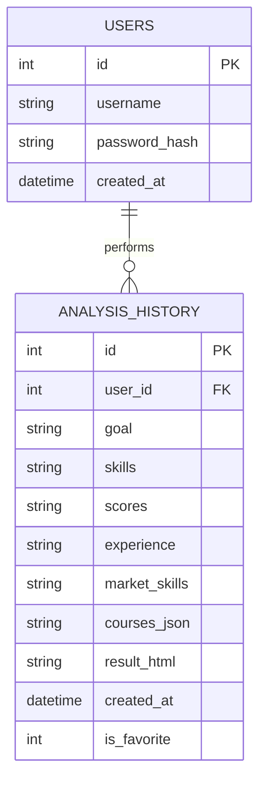

# SkillGap AI: Database Schema & Architecture

The application utilizes an **SQLite** database (`db/app.db`) to manage user profiles and persist their skill analysis history.

---

## 📊 Entity Relationship Diagram

---

## 🗂️ 1. `users` Table
Stores secure credentials for registered applicants.

| Column | Type | Constraints | Description |
| :--- | :--- | :--- | :--- |
| `id` | INTEGER | PRIMARY KEY | Unique ID generated automatically. |
| `username` | TEXT | UNIQUE, NOT NULL | Unique login identifier. |
| `password_hash` | TEXT | NOT NULL | Securely hashed password (Bcrypt). |
| `created_at` | DATETIME | DEFAULT | Local timestamp of account creation. |

---

## 📜 2. `analysis_history` Table
Captures the detailed output of each skill gap assessment.

| Column | Type | Description |
| :--- | :--- | :--- |
| `id` | INTEGER | Unique identifier for each report. |
| `user_id` | INTEGER | Reference to the user who performed the analysis. |
| `goal` | TEXT | The user-provided career target (e.g., "DevOps Engineer"). |
| `skills` | TEXT | Comma-separated list of identified skills. |
| `market_skills` | TEXT | Industry standards fetched via Gemini AI. |
| `courses_json` | TEXT | Recommended learning paths (formatted JSON). |
| `result_html` | TEXT | Full HTML-rendered analysis for display. |
| `is_favorite` | INTEGER | Boolean flag (0/1) for quick access/bookmarks. |

> [!NOTE]
> All history records are automatically deleted if the associated user account is removed (`ON DELETE CASCADE`).

### ⚡ Optimization Strategy
The database is indexed to ensure smooth performance even as history grows:
- **Main Index**: `idx_analysis_history_user_id` for fast data retrieval per user.
- **Sorted Index**: Combined `user_id` and `created_at` for chronological dashboard views.
- **Filter Index**: Optimized for searching through "Favorited" analysis records.
